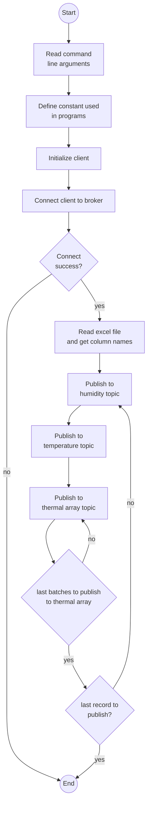

```mermaid
flowchart TD
S((Start))
E((End))
P[Read command\n line arguments]
D[Define constant used\n in programs]
R[Read excel file\n and get column names]
I[Initialize client]
C[Connect client to broker]
F1{Connect\n success?}
F2{last record to\n publish?}
F3{last batches to publish\n to thermal array}
PubH[Publish to\n humidity topic]
PubT[Publish to\n temperature topic]
PubTA[Publish to\n thermal array topic]

S --> P --> D --> I --> C
C --> F1 -->|yes| R
F1 -->|no| E
R --> PubH --> PubT --> PubTA
PubTA --> F3
F3 -->|no| PubTA
F3 -->|yes| F2
F2 -->|no| PubH
F2 -->|yes| E
```