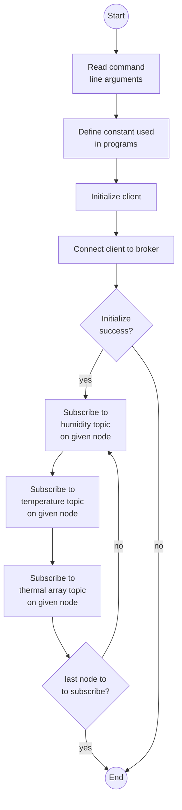

```mermaid
flowchart TD
S((Start))
E((End))
P[Read command\n line arguments]
D[Define constant used\n in programs]
I[Initialize client]
C[Connect client to broker]
SubH[Subscribe to\n humidity topic\n on given node]
SubT[Subscribe to\n temperature topic\n on given node]
SubTA[Subscribe to\n thermal array topic\n on given node]
F1{Initialize\n success?}
F2{last node to\n to subscribe?}

S --> P --> D --> I --> C
C --> F1 -->|yes| SubH --> SubT --> SubTA --> F2 -->|yes| E
F1 -->|no| E
F2 -->|no| SubH
```